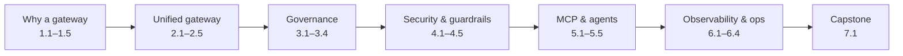

# Tetrate AI Gateway for Apigee & Java Developers

!!! bottomline "Bottom line"
    You already know how to put a **gateway** in front of services (Apigee) and how to **call an LLM** from a Spring app. This course joins those two skills: in **29 atomic sessions** you go from *"my services each call OpenAI directly"* to operating a **governed, multi-provider AI gateway** — token budgets, guardrails, and MCP tools — on **Tetrate**, with every concept anchored to something you already know.

<p class="lead">A from-the-basics course for Java / Spring developers who know Apigee. The lens is a <strong>double anchor</strong>: each capability is bridged from the Apigee object you'd reach for <em>and</em> from the Spring code you write today — then we show the handful of things that are genuinely new because the payload is now <strong>tokens, prompts, and tool calls</strong>. Built on the open-source <strong>Envoy AI Gateway</strong> and Tetrate's managed tiers, with copy-pasteable labs throughout.</p>

## How this course is built

Three rules keep it learnable:

- **MINTO / answer-first.** Every session opens with its **bottom line** — the one thing you'll be able to do — then supports it.
- **MECE.** The seven parts are *mutually exclusive* (no concept taught twice) and *collectively exhaustive* (together they cover the AI gateway as it applies to real, governed AI traffic).
- **Atomic, but cumulative.** Each session is self-contained — one objective, one lab, one stretch goal — yet explicitly **builds on** the one before: from one gateway call → unified routing → governance → guardrails → MCP/agents → operated platform → capstone.



## The double anchor

This course never teaches an AI-gateway feature in the abstract. It names the two things you already know that it maps onto — then where the mapping stops:

!!! apigee "From Apigee"
    An **AI gateway is an API-management product for LLM traffic.** Your proxy becomes an **AIGatewayRoute**, your TargetServer an **AIServiceBackend**, your Quota a **token rate limit**, your API Product a **model access tier**. Most of Apigee transfers — the *units* change from requests and resources to **tokens, prompts, and tools**.

!!! java "From Java microservices"
    Today each service holds an `OPENAI_API_KEY`, wraps the call in Resilience4j, logs the prompt, and hopes finance never asks who spent what. The gateway is where **all of that moves out of every service** — you change `spring.ai.openai.base-url` to point at the gateway, and the cross-cutting concerns become *configuration you operate*, not code you copy.

## Explore the curriculum

Every card is a session; the hook shown is the Apigee anchor. Click in, or track your progress — completion ticks are saved in your browser.

```widget
{"type":"curriculummap"}
```

## What you need

- Working **Java / Spring** experience and familiarity with **Apigee** API-gateway concepts (proxies, products, quotas, OAuth). This course assumes both and bridges from them.
- Basic comfort calling an LLM API (the OpenAI Chat Completions shape). **No prior Tetrate or Envoy experience assumed.**
- A terminal with `curl`; for the self-hosted labs, a Kubernetes cluster (a local `kind`/`minikube` is fine), `kubectl`, and the `aigw` CLI. The managed on-ramp (Tetrate Agent Router Service) needs only `curl` and an API key.

!!! note "Conventions"
    Every code block has a **Copy** button. Commands assume `bash` / `zsh`. Replace placeholders like `$ROUTER_KEY`, `$GATEWAY_HOST`, and `$NAMESPACE` with your own values. YAML is Kubernetes / Envoy AI Gateway configuration; Java examples use Spring AI or the OpenAI Java SDK.

---

<small>An independent learning resource. "Tetrate", "Envoy", "Apigee", "Google Cloud", "OpenAI", "Anthropic", and related marks belong to their respective owners. Envoy AI Gateway is an open-source project. Always validate against the current official Tetrate and Envoy AI Gateway documentation before production use. "Mayari" names the visual theme only.</small>
