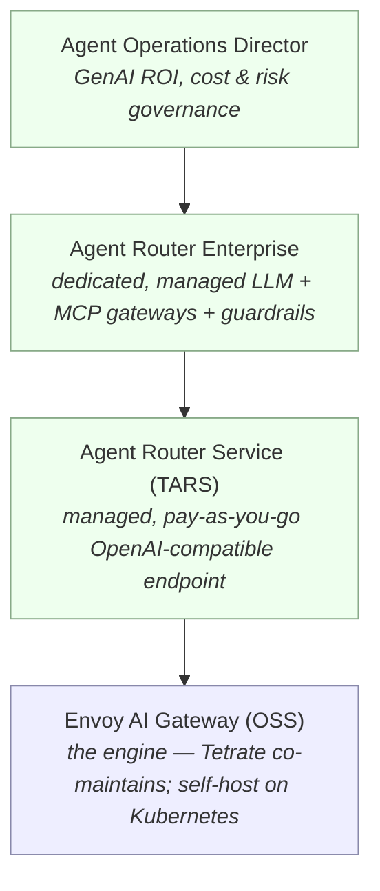

# 1.3 — Tetrate's AI landscape: TARS, Agent Router Enterprise & Envoy AI Gateway

!!! bottomline "Bottom line"
    Tetrate's AI products are a **ladder built on one engine**. At the base is the open-source **Envoy AI Gateway** (which Tetrate co-maintains); on top of it sit a managed pay-as-you-go endpoint (**Agent Router Service / TARS**), a dedicated managed offering (**Agent Router Enterprise**), and a governance/ROI layer (**Agent Operations Director**). By the end of this session you can place each on the ladder and pick the on-ramp that fits your org — and the one constraint that would push you up a rung.

## Why this exists

The first question every platform team asks is "managed or self-hosted?" — and they ask it because they've been burned by picking wrong. With Apigee you've lived this: SaaS gets you running today but owns your control plane; the self-managed runtime gives you control but you own the upgrades, the capacity, and the 2am page. The good news is that Tetrate's AI products are deliberately *the same engine at every rung*, so the choice is about operational ownership, not about a different product you'd have to re-learn.

That matters because it removes the usual lock-in fear. The open-source **Envoy AI Gateway** is the runtime. **TARS** is that runtime, hosted for you, reachable as an OpenAI-compatible endpoint with a credit card and a scoped key. **Agent Router Enterprise** is a dedicated, managed deployment with the enterprise governance and MCP features. **Agent Operations Director** sits above all of it for cost/ROI/risk governance. You can start at the top of the ladder (zero infra) and descend to self-hosting later — or start self-hosted — without throwing away your mental model, because the CRDs and the request shape are shared.

So this session is a *decision*, not a feature tour. Where do you get on, and what would make you move?

!!! apigee "From Apigee"
    This is the **Apigee SaaS vs hybrid vs runtime** decision you already know how to make. TARS is Apigee-as-a-SaaS: Tetrate runs the control and data plane, you consume an endpoint and manage keys and products. Agent Router Enterprise is closer to a **dedicated/managed** deployment — your own governed gateways (for LLMs *and* MCP tools) with guardrails, operated for you. Self-hosting the open-source Envoy AI Gateway is running the **Apigee runtime yourself** on your own Kubernetes: maximum control, maximum operational ownership. The constraint that pushes you up a rung is the same one that pushed you from runtime to SaaS in Apigee — data residency, dedicated isolation, enterprise auth, or simply not wanting to operate it.

!!! java "From Java microservices"
    Think of it as the **Spring Boot starter vs building your own auto-configuration**. TARS is the starter: add one dependency-equivalent (a base URL and a key) and you're calling models in minutes, with Tetrate owning the wiring. Self-hosting the open-source gateway is writing your own `@Configuration` — you assemble the CRDs, run them on your cluster, and own the lifecycle, in exchange for total control over routing, secrets, and where the bytes flow. Agent Router Enterprise is the managed middle: the starter's convenience with the production knobs (isolation, governance, MCP) you'd otherwise build yourself.

!!! breaks "Where the analogy breaks"
    The Apigee tiering analogy holds for *operational ownership* but misses what Tetrate's top rung adds. **Agent Operations Director** has no real Apigee equivalent: it governs **GenAI cost, ROI, and risk** — questions like "is this agent worth its token spend?" and "which teams are over budget on premium models?" — which only exist because the cost unit is variable tokens (1.2) and the workload is autonomous agents. That's a governance surface Apigee never needed because REST calls have fixed cost and no autonomy. Don't map it to "just more analytics" — it's a different question class.

## The concept

Picture the products as a ladder, with the open-source engine at the base and managed/governance layers stacked on top. You can board at any rung; the engine underneath is the same.



Read the ladder top-down as "more managed / more governance," bottom-up as "more control / more ownership." The key insight is the single arrow of inheritance: every rung is the **Envoy AI Gateway engine**, so the routing model, the OpenAI-compatible API, and the CRD vocabulary you'll learn in 1.5 are constant. Choosing a rung is choosing *who operates it and how much governance comes pre-assembled*, not choosing a different technology.

For most readers starting this course, the right first rung is **TARS**: it's an OpenAI-compatible managed endpoint at `https://router.tetrate.ai`, with scoped API keys and pay-as-you-go pricing (you pay the underlying model cost plus a small service margin). It gets you a real governed call in session 1.4 with zero infrastructure. You then descend to self-hosting the open-source gateway in 1.5 to see the resources underneath — so you understand both ends of the ladder before Part 2.

!!! pitfall "Watch out"
    Don't confuse the **open-source Envoy AI Gateway** with classic **Envoy Gateway** (the general Kubernetes ingress). The AI gateway is built *on top of* Envoy Gateway and adds the AI-specific CRDs (`AIGatewayRoute`, `AIServiceBackend`, `BackendSecurityPolicy`) and token-aware policies. If you install plain Envoy Gateway expecting model routing and token metering, you'll find none of it — you need the AI Gateway layer. Verify product names and the exact set of CRDs against the docs for your release before you provision anything.

## Hands-on lab

The goal here is a decision you can defend, plus a TARS key you'll use in the next session. If you can't sign up (corporate card/approval), the steps are written so you can still produce the decision artifact and stub the key.

<div class="lab" markdown="1">
#### Lab — get on the ladder

**1. Provision a TARS key.** Sign in at the Agent Router Service portal and create a scoped API key, then export it as `$ROUTER_KEY` — this is the credential session 1.4 uses:

```bash
# after creating a key in the portal (https://router.tetrate.ai)
export ROUTER_KEY="tars_..."        # paste your scoped key
echo "${ROUTER_KEY:0:5}***"          # confirm it's set without printing it
```

!!! pitfall "Watch out"
    A TARS key is a **gateway key, not a provider key** — it bills *your* TARS account (model cost plus margin), so treat it like any spend-bearing secret: scope it, don't commit it, and rotate it. Pasting it into a shared notebook or a public repo is a real financial liability, not just a security one. If you can't get a key approved yet, set `ROUTER_KEY=PLACEHOLDER` and do the decision step below; you'll wire the real key in 1.4.

**2. Write the tier decision for your org.** In a short doc, record which rung you'd start on and, crucially, the *one constraint* that would push you up:

```text
Starting rung: TARS (managed, pay-as-you-go)
Why: zero infra, OpenAI-compatible, want a governed call this week.

Constraint that pushes me UP a rung:
  → "Prompts contain regulated data that can't transit a shared multi-tenant
     endpoint" → Agent Router Enterprise (dedicated, managed).
  → "Finance needs GenAI ROI + per-team risk governance across all agents"
     → add Agent Operations Director.

Constraint that pushes me DOWN to self-host (OSS Envoy AI Gateway):
  → "All inference and secrets must stay inside our VPC / on our clusters"
     → self-host on Kubernetes (you build this in 1.5).
```

**3. Sanity-check the engine is shared.** Note one fact that proves the ladder isn't four products to learn: the request you'll send to TARS in 1.4 (`POST /v1/chat/completions`, OpenAI body) is the *same* request shape you'll route through the self-hosted gateway in 1.5. Write that line in your doc — it's the reason picking a rung is low-risk.

**What success looks like:** `$ROUTER_KEY` is exported (or explicitly stubbed with a plan to get one), and you have a one-paragraph decision naming your starting rung **and** the single constraint that would move you up or down. You've made the managed-vs-self-hosted call deliberately, knowing the engine underneath is constant.

</div>

## Verify it

You're ready to move on when you can answer, without looking back:

- What sits at the base of the ladder, and who maintains it? *(The open-source Envoy AI Gateway; Tetrate co-maintains it.)*
- What is TARS in one sentence? *(A managed, pay-as-you-go, OpenAI-compatible endpoint at `https://router.tetrate.ai` with scoped keys — the same engine, hosted.)*
- What does Agent Operations Director add that has no Apigee analogue? *(GenAI ROI, cost, and risk governance over agent workloads — a question class that only exists with variable token cost and autonomy.)*

Confirm your key is set without printing it:

```bash
test -n "$ROUTER_KEY" && echo "ROUTER_KEY is set (${#ROUTER_KEY} chars)" || echo "ROUTER_KEY missing"
```

!!! failure "Common failure modes"
    - **Treating the rungs as four separate products.** They're one engine with increasing management/governance. If your plan assumes a re-platform to move between them, you've mis-modelled the ladder.
    - **Picking a tier on price alone.** The decision is driven by a *constraint* (data residency, isolation, governance, ops capacity), not by the sticker. A tier with no triggering constraint is the wrong tier.
    - **Confusing Envoy AI Gateway with Envoy Gateway.** The AI layer and its CRDs are what give you model routing and token metering; plain Envoy Gateway has none of it.
    - **Leaking the TARS key.** It's spend-bearing. A committed `$ROUTER_KEY` is a billable incident, not just a security one.

!!! stretch "Stretch goal"
    Map your own org onto the ladder with evidence. Write down the *actual* policy or regulation (e.g. a data-residency clause, a procurement rule, an existing Apigee Org's compliance scope) that decides your rung — not a hypothetical. Then write the one future event that would force a move (a new regulated workload, a finance mandate for GenAI ROI). If you already run Apigee SaaS vs hybrid for a real reason, that same reason almost always selects your AI-gateway rung — name it explicitly.

## Recap & next

You can now place Tetrate's AI products on a single ladder built on the open-source Envoy AI Gateway: TARS (managed, pay-as-you-go), Agent Router Enterprise (dedicated, managed, with MCP and guardrails), and Agent Operations Director (GenAI ROI/cost/risk governance). You've picked a starting rung, named the constraint that would move you, and exported a `$ROUTER_KEY` for the next step.

**Next — 1.4:** make your first governed LLM call. You'll point a client at TARS by changing one line — the base URL — and watch identical code return completions from two different model vendors, with no provider key anywhere in your app.
