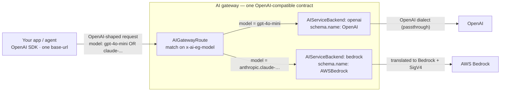

# 2.1 — One API, many providers: the OpenAI-compatible schema

!!! bottomline "Bottom line"
    The gateway speaks **one client-facing contract — the OpenAI chat-completions API — to many providers**. Each provider is an **AIServiceBackend** whose `schema.name` (`OpenAI`, `AWSBedrock`, `Anthropic`, …) tells the gateway that vendor's dialect, so it can translate your OpenAI-shaped request into whatever the upstream expects. By the end you can put a second provider behind the same route and reach it by changing only the `model` field — same client, same SDK, different vendor.

## Why this exists

Every model vendor invented its own request and response shape. OpenAI has `messages` and `choices`; Anthropic has `system` separate from `messages` and returns `content` blocks; Bedrock wraps a model-specific body in its own envelope and signs requests with SigV4. If each of your services talks to each vendor natively, you've re-created the integration sprawl from session 1.1 — now multiplied by the number of providers, with a different SDK and auth scheme per vendor baked into your code.

The fix is a **lingua franca**. Clients always send the OpenAI-compatible shape to one endpoint. The gateway holds a per-provider **API schema adapter** and translates: OpenAI-in to Bedrock-out, OpenAI-in to Anthropic-out, OpenAI-in to OpenAI-out (a passthrough). Your app never learns a second dialect. Switching or adding a vendor becomes an *operations* change at the edge — declare an AIServiceBackend with the right `schema.name` and a route rule — not a code change in every service.

This is the foundation the rest of Part 2 stands on. Credentials (2.2), model routing and the approved catalog (2.3), and cross-provider failover (2.4) all assume this one-contract-many-backends shape. Get it right here and those become policy on top.

!!! apigee "From Apigee"
    An AIServiceBackend is a **TargetServer plus a schema adapter**. In Apigee, fronting two backends with different payload shapes behind one proxy meant a JSON-to-JSON or XSL transform on the request and response flows, normalising each backend to a single client-facing contract. The AIServiceBackend's `schema.name` *is* that transform, but pre-built and maintained by the gateway per provider — you select the adapter (`OpenAI`, `AWSBedrock`, …) instead of hand-writing the mediation. The route that picks between backends is your RouteRules; the new part is that the routing key is a **model name**, not a path.

!!! java "From Java microservices"
    You already know this pattern as **one interface, many implementations**. Think of a single `ChatClient` (or a `ChatModel` interface) with an `OpenAiChatModel`, an `AnthropicChatModel`, and a `BedrockChatModel` behind it, chosen by configuration. Spring AI gives you that abstraction *inside the JVM* — but you still ship every provider's SDK, every credential, and the wiring to pick one. The gateway lifts that polymorphism to the **edge**: your code keeps the one OpenAI-shaped client, and the implementation is resolved by the `model` you ask for, server-side. The strategy pattern, operated as infrastructure.

!!! breaks "Where the analogy breaks"
    A schema adapter is **not a lossless cast**. Providers differ in capabilities, not just field names: a parameter, a tool-calling format, a streaming nuance, or a stop-reason that one vendor supports may have no faithful equivalent in another. An Apigee transform mapped a known schema to a known schema; here the *semantics* can drift between models, so an identical OpenAI-shaped request can behave subtly differently across backends. Treat the OpenAI contract as the reliable common subset, and verify any provider-specific feature you depend on rather than assuming the adapter makes vendors interchangeable.

## The concept

One endpoint and one schema in front; many AIServiceBackends, each tagged with its provider dialect, behind. The `model` name in the request body is the routing key the gateway resolves to a backend:



Mechanically, the gateway reads the `model` field from the JSON body and surfaces it as the `x-ai-eg-model` header. The AIGatewayRoute's `rules[].matches[].headers` test that header and select a `backendRefs` target. Each target is an AIServiceBackend whose `schema.name` tells the gateway how to translate the body and sign the upstream call. So a single OpenAI-compatible POST fans out to the right vendor purely by the model you name — no path change, no second SDK, no client awareness of which provider answered.

!!! pitfall "Watch out"
    The `model` string is doing double duty: it's both the **routing key** and the **upstream model identifier**. For OpenAI that's friendly (`gpt-4o-mini`); for Bedrock it's the provider's exact model ID, e.g. `anthropic.claude-3-5-sonnet-20241022-v2:0` — colons, dots, and version suffixes included. Your route's header `value:` must match the string clients actually send, character for character. A mismatch doesn't fall back; it 404s at the route because no rule matched. (Session 2.3 introduces *virtual* model names so clients stop carrying these raw IDs.)

The win is operational leverage. Adding Anthropic-via-Bedrock to your platform is two objects and a route rule — zero lines changed in any of the dozen services that call the gateway. The contract they depend on never moved.

## Hands-on lab

<div class="lab" markdown="1">
#### Lab — add a second provider behind one route

**Prereqs:** the self-hosted gateway from 1.5 with the OpenAI backend working (export `$NAMESPACE` and `$GATEWAY_HOST`), `kubectl`, and credentials for a second provider — this lab uses **AWS Bedrock** (an access key/secret with Bedrock permissions). The whole point: you'll add Bedrock *without touching the client*.

**1. Create the Bedrock credential Secret.** Bedrock authenticates with AWS credentials, not a single API key:

```bash
kubectl create secret generic bedrock-creds -n "$NAMESPACE" \
  --from-literal=credentials="[default]
aws_access_key_id=$AWS_ACCESS_KEY_ID
aws_secret_access_key=$AWS_SECRET_ACCESS_KEY"
```

**2. Declare the second AIServiceBackend with `schema.name: AWSBedrock`** plus its Backend host and an `AWSCredentials` BackendSecurityPolicy. The schema name is the only thing that tells the gateway to translate and SigV4-sign:

```yaml
apiVersion: gateway.envoyproxy.io/v1alpha1
kind: Backend
metadata:
  name: bedrock
  namespace: ${NAMESPACE}
spec:
  endpoints:
    - fqdn:
        hostname: bedrock-runtime.us-east-1.amazonaws.com
        port: 443
---
apiVersion: aigateway.envoyproxy.io/v1alpha1
kind: AIServiceBackend
metadata:
  name: bedrock
  namespace: ${NAMESPACE}
spec:
  schema:
    name: AWSBedrock            # <- the adapter: OpenAI-in, Bedrock-out
  backendRef:
    name: bedrock
    kind: Backend
    group: gateway.envoyproxy.io
---
apiVersion: aigateway.envoyproxy.io/v1alpha1
kind: BackendSecurityPolicy
metadata:
  name: bedrock-cred
  namespace: ${NAMESPACE}
spec:
  type: AWSCredentials          # region + signed creds, not a bearer key
  awsCredentials:
    region: us-east-1
    credentialsFile:
      secretRef:
        name: bedrock-creds      # the Secret from step 1 (key: credentials)
  targetRefs:
    - group: aigateway.envoyproxy.io
      kind: AIServiceBackend
      name: bedrock
```

!!! pitfall "Watch out"
    Don't reuse the OpenAI `BackendSecurityPolicy` here. `type: APIKey` injects a bearer token; Bedrock needs `type: AWSCredentials` with a region so the gateway can SigV4-sign every upstream call. Same resource *kind*, completely different `type` and sub-fields. Verify the exact `awsCredentials`/`credentialsFile` field names against the API reference for your release — the credential sub-schema is the part most likely to have changed between versions.

**3. Add a route rule for the Bedrock model** so the same AIGatewayRoute now matches a second `x-ai-eg-model`. Append to the route's `rules` — both rules live under one route, one endpoint:

```yaml
  rules:
    - matches:                                   # existing OpenAI rule
        - headers:
            - type: Exact
              name: x-ai-eg-model
              value: gpt-4o-mini
      backendRefs:
        - name: openai
    - matches:                                   # NEW Bedrock rule
        - headers:
            - type: Exact
              name: x-ai-eg-model
              value: anthropic.claude-3-5-sonnet-20241022-v2:0
      backendRefs:
        - name: bedrock
```

**4. Apply and confirm both rules are programmed:**

```bash
kubectl apply -f bedrock.yaml -f aigatewayroute.yaml
kubectl get aigatewayroute ai-gateway-route -n "$NAMESPACE" \
  -o jsonpath='{.status.conditions[?(@.type=="Accepted")].status}{"\n"}'
```

**5. Call both providers through the one endpoint — changing only `model`.** Identical curl, identical headers, identical SDK; the vendor is chosen by the model name:

```bash
# OpenAI
curl -s "http://$GATEWAY_HOST/v1/chat/completions" -H "content-type: application/json" \
  -d '{"model":"gpt-4o-mini","messages":[{"role":"user","content":"Which provider am I?"}]}' \
  | jq -r '.choices[0].message.content'

# Bedrock — same endpoint, only the model changed
curl -s "http://$GATEWAY_HOST/v1/chat/completions" -H "content-type: application/json" \
  -d '{"model":"anthropic.claude-3-5-sonnet-20241022-v2:0",
       "messages":[{"role":"user","content":"Which provider am I?"}]}' \
  | jq -r '.choices[0].message.content'
```

**What success looks like:** both calls return OpenAI-shaped completions from the same `/v1/chat/completions` endpoint, with the *only* difference between them being the `model` string. One client, one contract, two providers — and a Spring app pointed at this gateway would reach Bedrock with zero code change, just a different model name.
</div>

## Verify it

You're done when one client demonstrably reaches two vendors:

- Both curls return a valid `choices[0].message.content` from the same base URL. The response shape is OpenAI's for both, even though Bedrock's native API is nothing like it — proof the schema adapter translated the response back.
- Swapping only the `model` field flips providers. If changing `model` 404s, the route's header `value:` doesn't match the exact string you sent — fix the match, not the client.
- A point-in-code check: search your app for provider SDKs and confirm only the OpenAI client remains. Reaching Bedrock added zero imports.

!!! failure "Common failure modes"
    - **Wrong `schema.name` for the provider.** Tag a Bedrock backend `OpenAI` and the gateway sends an un-translated, un-signed body upstream. *(Symptom: 400/403 from AWS, never a completion.)*
    - **Route `value:` doesn't equal the client's `model`.** Especially for Bedrock IDs with colons and version suffixes. No rule matches; the request 404s at the route rather than falling through.
    - **Credential type/schema mismatch.** `APIKey` where the provider needs `AWSCredentials` (or vice versa). The route is `Accepted` but every upstream call is unauthorized. Match the BackendSecurityPolicy `type` to the provider.
    - **Assuming feature parity across the adapter.** A parameter or tool-call format that works on OpenAI may be ignored or rejected by another vendor — the contract is the common subset, not a guarantee.

!!! stretch "Stretch goal"
    Point a tiny Spring AI app (one `ChatClient`, `spring.ai.openai.base-url` set to your gateway) at this route and call it twice — once with each model name — from the *same* code path, with no provider SDK for the second vendor on the classpath. Confirm both responses come back through the single client. That's the one-interface-many-implementations pattern, resolved entirely at the edge.

## Recap & next

You can now explain the **OpenAI-compatible schema as the lingua franca**, configure a per-provider **AIServiceBackend** whose `schema.name` selects the adapter, and route to multiple vendors from one endpoint by model name alone. You added a second provider with zero client changes — the contract your services depend on never moved.

**Next — 2.2:** the credential you just attached, examined properly. You'll use **BackendSecurityPolicy** to keep provider keys entirely out of app code, understand exactly how the gateway injects upstream auth, and rotate a key by editing only a Secret — no application redeploy.
