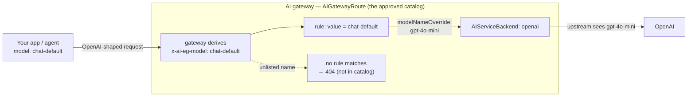

# 2.3 — Model routing & the approved model catalog

!!! bottomline "Bottom line"
    An **AIGatewayRoute** doesn't just pick a *provider* — it picks a *model*, matching the `x-ai-eg-model` header the gateway derives from the request body. That makes the route the place where you publish a **curated catalog of approved models**, and where you define **virtual model names** — a client-facing alias like `chat-default` that `modelNameOverride` maps to a concrete provider model. By the end you can route by model name, alias a virtual model, and swap the model behind it with **zero client change**.

## Why this exists

In 2.1 you put many providers behind one OpenAI-compatible contract; in 2.2 the gateway, not your app, holds the keys. But your clients are still sending raw provider model IDs — `gpt-4o-mini`, `anthropic.claude-3-5-sonnet-20241022-v2:0` — and *any* string they invent reaches *some* upstream unless a rule says otherwise. That's two problems wearing one coat. First, there's no **approved list**: a team can name a model you never vetted for cost, residency, or safety, and the gateway happily forwards it. Second, the concrete model ID is **hard-coded in every caller**, so the day you want to move off a deprecated model, or A/B a cheaper one, you're chasing redeploys across a dozen services.

The AIGatewayRoute solves both because it matches on the model name. A request only succeeds if its model maps to a rule you wrote — so the set of rules *is* the catalog of what's allowed, and everything else 404s at the edge. That turns "which models exist here?" from tribal knowledge scattered across `application.yml` files into one declarative object an operator owns.

The second half of the answer is **virtualization**. The route can match a *virtual* name — `chat-default`, `embeddings-prod` — and use `modelNameOverride` on the backend to rewrite it to the provider's real model ID before the upstream call. Clients ask for the stable alias; you decide, at the edge, what that alias currently resolves to. Swapping `gpt-4o-mini` for a newer model, or shifting an alias from OpenAI to Bedrock, becomes a one-line route edit with no client awareness at all.

!!! apigee "From Apigee"
    Two Apigee constructs map cleanly here. The matching is **RouteRules with a condition keyed on the request** — except the condition reads a model name (surfaced as `x-ai-eg-model`) instead of a path or a header you set by hand, and it selects a backend the way your RouteRules selected a TargetEndpoint. The catalog is an **API Product, but for models**: in Apigee a Product bundles the operations a key is entitled to call; here the set of route rules bundles the models that are reachable at all. And the virtual name is the same instinct as fronting a backend whose real URL changes behind a stable proxy basepath — `modelNameOverride` is the AssignMessage that rewrites the target identifier on the way out, so the client-facing name never moves.

    | Apigee | AI gateway |
    |---|---|
    | RouteRule condition selecting a TargetEndpoint | AIGatewayRoute rule matching `x-ai-eg-model` → `backendRefs` |
    | API Product = the set of allowed operations | The route's rules = the set of allowed models (the catalog) |
    | Stable proxy basepath, changeable target URL | Virtual model name, changeable `modelNameOverride` |
    | AssignMessage rewriting the target on egress | `modelNameOverride` rewriting the model ID upstream |

!!! java "From Java microservices"
    Today the model string is a magic constant sprinkled across services — `"gpt-4o-mini"` in a `@Value`, a constructor arg, a prompt-builder, three different YAMLs that have already drifted. You know how this ends, because you've lived it with feature flags and endpoint URLs: the moment the value needs to change, it's a coordinated redeploy and a hunt for the copies you missed. The approved catalog is the **single place "which models exist" lives**, exactly like pulling shared configuration into a config server so services read a name, not a hard-coded value. The virtual model alias is that config key: services ask for `chat-default`, and the resolution to a concrete model happens centrally, server-side, with no rebuild when it changes.

!!! breaks "Where the analogy breaks"
    An Apigee API Product is an explicit allow-list object you attach to a key; the model catalog here is **emergent from the route rules** — there's no separate "Product" resource that says "these five models." Reason about it as "what a rule matches is what exists," not "what's listed in a product," or you'll look for an entitlement object that isn't there (per-caller model entitlement is a *later* concern — that's identity and tiers in Part 4, not this route). And the config-server analogy breaks on *direction*: a config server hands a value to the app, which then acts on it; here the app never receives the resolved model name at all — the rewrite happens **after** the app's request leaves it, on the upstream hop, so the client genuinely cannot tell which concrete model answered. The indirection is one-way and invisible by design.

## The concept

The `model` field in the JSON body becomes the routing key. The gateway lifts it into the `x-ai-eg-model` header, a route rule matches it, and the selected backend may rewrite it to the real provider model before the upstream call:



Mechanically: the AI Gateway filter reads `model` from the body and exposes it as `x-ai-eg-model`. Each `rules[].matches[].headers` entry tests that header (`type: Exact`, a `value:`), and the matching rule's `backendRefs` names the AIServiceBackend to call. The new field for this session is `modelNameOverride`, set **per backendRef**: when present, the gateway rewrites the outgoing model identifier to that value before signing the upstream call. So a client-facing `chat-default` can resolve to `gpt-4o-mini` on OpenAI today and to a Bedrock Claude model tomorrow — same alias, different override, no client change. Because only named values match, an unlisted model name has nowhere to go: it 404s at the route, which is precisely the enforcement that makes the rule set an *approved* catalog rather than a suggestion.

!!! pitfall "Watch out"
    A virtual model name is **only** approved if a rule actually matches it. There is no implicit pass-through: a request for a model with no matching rule fails at the route, but a request that *does* match an over-broad rule succeeds unconditionally — the route does not check *who* is asking. So don't mistake "the catalog exists" for "this caller may use this model." The catalog says which models the platform offers; per-team or per-tier entitlement (only the `premium` team may reach `chat-premium`) is identity-scoped policy you add in Part 4. Treating a permissive catalog as an authorization boundary is how an intern's service ends up calling your most expensive model.

A useful consequence of `modelNameOverride` living on the *backendRef*: the same virtual name can fan out to multiple backends, each rewriting to its own native ID. `chat-default` → OpenAI's `gpt-4o-mini` and Bedrock's Claude ID under one rule is how cross-provider failover (2.4) and weighted A/B both express themselves — different overrides, one alias the client never has to learn.

## Hands-on lab

<div class="lab" markdown="1">
#### Lab — define a virtual model and swap the model behind it

**Prereqs:** the self-hosted gateway from 1.5 with a working OpenAI backend and credential (2.1/2.2), `kubectl`, and `$NAMESPACE` / `$GATEWAY_HOST` exported. The goal: publish a virtual `chat-default`, prove clients reach a real model through it, then change the backing model with **no client edit**. (Field names track the Envoy AI Gateway version — verify the `modelNameOverride` and route shape against the model-name-virtualization docs for your release.)

**1. Add a rule that matches a virtual name and overrides it to a real model.** Define the route from 2.1 so `chat-default` resolves to `gpt-4o-mini` on the OpenAI backend:

```yaml
apiVersion: aigateway.envoyproxy.io/v1alpha1
kind: AIGatewayRoute
metadata:
  name: ai-gateway-route
  namespace: ${NAMESPACE}
spec:
  parentRefs:
    - name: ai-gateway                 # the Gateway from 1.5
  rules:
    - matches:                          # the VIRTUAL model: the approved catalog entry
        - headers:
            - type: Exact
              name: x-ai-eg-model
              value: chat-default       # what clients ask for (stable alias)
      backendRefs:
        - name: openai
          modelNameOverride: gpt-4o-mini   # what the upstream actually receives
```

**2. Apply it and confirm the route is programmed:**

```bash
kubectl apply -f aigatewayroute.yaml
kubectl get aigatewayroute ai-gateway-route -n "$NAMESPACE" \
  -o jsonpath='{.status.conditions[?(@.type=="Accepted")].status}{"\n"}'
```

!!! pitfall "Watch out"
    The `value:` clients send and the route's match must be identical, character for character — and clients now send the **virtual** name (`chat-default`), not the provider ID. If a service still hard-codes `gpt-4o-mini` in its `model` field, it bypasses your alias entirely (or 404s if you removed the raw rule), and the swap in step 5 won't reach it. The whole payoff depends on callers having moved to the virtual name; grep your services for raw model strings before you rely on the indirection.

**3. Call the model through the virtual name.** The client never names `gpt-4o-mini`:

```bash
curl -s "http://$GATEWAY_HOST/v1/chat/completions" -H "content-type: application/json" \
  -d '{"model":"chat-default",
       "messages":[{"role":"user","content":"Which model answered this?"}]}' \
  | jq -r '.choices[0].message.content'
```

**4. Confirm an unlisted model is rejected — the catalog is enforced.** A model with no rule has nowhere to go:

```bash
curl -s -o /dev/null -w "unlisted model -> HTTP %{http_code}\n" \
  "http://$GATEWAY_HOST/v1/chat/completions" -H "content-type: application/json" \
  -d '{"model":"some-unapproved-model","messages":[{"role":"user","content":"hi"}]}'
# expect a 404 from the route: not in the catalog
```

**5. Swap the backing model — one line, no client change.** Re-point the alias (e.g. to a newer or cheaper model) by editing only `modelNameOverride`:

```yaml
      backendRefs:
        - name: openai
          modelNameOverride: gpt-4o          # was gpt-4o-mini; clients unaware
```

```bash
kubectl apply -f aigatewayroute.yaml
# re-run the curl from step 3 — identical request body, now served by the new model.
```

**What success looks like:** step 3 returns a completion though the client asked for `chat-default`; step 4 returns **404** for an unapproved model (the catalog rejected it); and step 5 changes which real model answers `chat-default` with **zero** change to the client's request. The model identity is now an operations decision at the edge, not a constant in every service.
</div>

## Verify it

You're done when the alias is real and the catalog is enforced:

- A request for `chat-default` succeeds, but the response never reveals — and the client never sent — the concrete model ID. The indirection holds.
- A request for an **unlisted** model returns `404` at the route. If it succeeds, you have an over-broad rule (a bare match, or a leftover raw-model rule) acting as an open door — tighten it.
- Editing `modelNameOverride` and re-applying changes which model answers the *same* request body. If you had to touch a client to make the swap, the client wasn't using the virtual name.

Confirm the catalog is exactly what you think it is:

```bash
# the approved catalog = the model values your route matches:
kubectl get aigatewayroute ai-gateway-route -n "$NAMESPACE" -o yaml \
  | grep -A1 'name: x-ai-eg-model'
```

!!! failure "Common failure modes"
    - **Clients still send raw provider IDs.** The virtual name exists but nobody uses it, so a swap reaches nothing. *(Symptom: editing `modelNameOverride` changes behavior for no real traffic.)*
    - **An over-broad or leftover rule.** A catch-all match, or the original `gpt-4o-mini` rule left in place, lets unapproved models through. *(Symptom: a model you never vetted returns 200.)*
    - **`modelNameOverride` set to a name the provider doesn't recognise.** The route matches and forwards, but the upstream rejects the model. *(Symptom: 404/400 from the provider, not the route — green route, failed upstream.)*
    - **Confusing catalog with entitlement.** Assuming a model in the catalog means a given caller may use it. The route gates *existence*, not *who*; per-caller limits are identity policy (Part 4).
    - **Alias collides with a real model name.** Naming a virtual model the same as a concrete provider ID makes routing ambiguous and migrations confusing — keep virtual names clearly synthetic (`chat-default`, not `gpt-4o`).

!!! stretch "Stretch goal"
    Point a Spring AI app's `model` at the virtual `chat-default` (not a provider ID), then perform a migration the app can't see: change `modelNameOverride` to route `chat-default` to a *different vendor's* model via a second AIServiceBackend, and confirm the app keeps answering with no rebuild. That's a provider migration executed entirely at the edge — the strongest argument for never letting a concrete model ID into application code again.

## Recap & next

You can now route on the **model name** the gateway exposes as `x-ai-eg-model`, treat the set of route rules as an **enforced approved catalog** (unlisted models 404), and publish **virtual model names** whose `modelNameOverride` you change to swap the backing model with no client change. Model identity is now governed at the edge, decoupled from every caller.

**Next — 2.4:** one virtual name, two backends behind it — and what happens when the first one fails. You'll configure **retries, timeouts, and cross-provider fallback** with a `BackendTrafficPolicy` and prioritized `backendRefs`, then force the primary to fail and watch the gateway serve transparently from the fallback.
