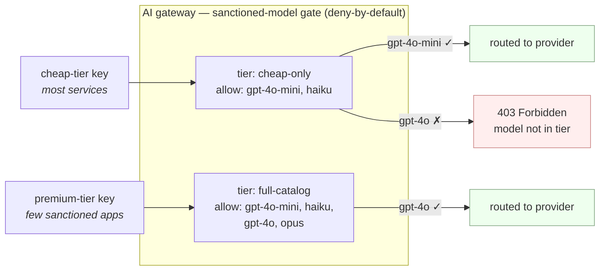

# 3.3 — Sanctioned-model governance & access tiers

!!! bottomline "Bottom line"
    A budget says how *much* a team may spend; a **sanctioned-model tier** says *which models it may call at all*. By the end of this session you can define access tiers — a cheap-only tier and a full-catalog tier — and enforce them **deny-by-default** at the gateway, so a cheap-tier key asking for the premium model gets a `403` instead of an expensive surprise. This is an API Product, but the entitlement is a set of models.

## Why this exists

Budgets (3.2) cap spend but don't constrain *capability*. A team with a generous budget can still point every call at your most expensive frontier model "just to be safe," and your token meter will dutifully bill them for it. Some models also carry compliance or data-residency constraints that make them simply **not allowed** for certain workloads, regardless of budget. You need to govern the *set of models a caller is entitled to*, not only the quantity of tokens.

That's a tiering problem, and it's exactly the one API products solved for REST: bundle a set of capabilities, attach limits and scopes, and grant it to an app. Here the bundle is a **model catalog** — a cheap-only tier for the long tail of services, a premium tier for the few workloads that justify it, perhaps a region-restricted tier for regulated data. The rule has to be **deny-by-default**: a caller may use a model only if its tier explicitly allows it. Hope is not an access policy — and crucially, the model name lives in the request body, fully under the client's control, so the *gateway* must be the thing that says no.

## The concept

A tier is a named bundle that maps an authenticated caller to the set of models it may invoke; the gateway gates each request on `(tier, requested-model)` and denies anything not on the list:



The mechanism reuses pieces you already have. The gateway knows **who** is calling (the API key / identity from 4.x) and **what** they asked for: the AI Gateway filter reads the model from the request body and exposes it as the `x-ai-eg-model` header — the same header you rate-limited on in 3.1. Tiering is then a policy that admits the request only when the caller's tier contains that model, and returns `403` otherwise. You can express the allow-list as route matching (a route per tier that only matches its sanctioned `x-ai-eg-model` values) or as an authorization policy keyed on the caller's tier claim. Either way the *enforcement point is the gateway*, not the application.

!!! pitfall "Watch out"
    **Enforce the allow-list at the gateway, never by trusting the client to send only approved model names.** The model string is just a field in the JSON body — any caller can put `gpt-4o` (or a brand-new, unbudgeted model) there. A client-side "we only call cheap models" convention is a comment, not a control. If the gate isn't a server-side policy that *rejects* unsanctioned `x-ai-eg-model` values, you have no model governance — you have a gentleman's agreement. Default-allow ("block the few we ban") fails the moment a new expensive model ships; **default-deny** ("allow only the few we sanction") is the only safe posture.

!!! apigee "From Apigee"
    A tier is an **API Product, where the bundled resources are models.** In Apigee a product grouped a set of API proxies/paths, attached a quota and scopes, and you granted it to an app via its key — the key carried the entitlement. Same here: the caller's key/identity maps to a tier, and the tier enumerates the sanctioned models exactly as a product enumerated allowed paths. Asking for a model outside your tier is the model-traffic version of calling a path your product doesn't include — and you'd expect a `403` for that, not a best-effort route. The grant model, the deny-by-default posture, and the "entitlement travels with the credential" idea all carry straight over.

!!! java "From Java microservices"
    This centralises the **"is this team allowed the expensive model?" check** you'd otherwise scatter across services. Today that lives as an `if (team.isPremium())` guard, a `@PreAuthorize` annotation, or a feature flag in config — duplicated per service, drifting between them, and trivially bypassed by any service that forgets it or hard-codes a different model name. Moved to the gateway, the entitlement is declared once, enforced uniformly for every caller, and impossible to skip by editing application code. It's the authorization rule pulled out of N services into one operated policy — the same reason you put auth in a filter rather than every controller.

!!! breaks "Where the analogy breaks"
    An Apigee product gates a **fixed, named set of paths** you defined up front. The model catalog is **open-ended and client-asserted**: callers can name models that don't exist, models you've never sanctioned, or models a provider shipped this morning — all as a free-text body field. So a tier can't only *enumerate what's allowed* and assume everything else is a known path; it must actively **reject the unknown**, because the space of possible model strings is unbounded and adversary-controlled. A REST product never had to defend against a caller inventing a new path mid-request; a model tier does. That's why deny-by-default isn't a preference here — it's structural.

## Hands-on lab

<div class="lab" markdown="1">
#### Lab — two tiers, and a refused premium model

**Prereqs:** the gateway and `AIGatewayRoute` from 1.5 (export `$NAMESPACE`, `$GATEWAY_HOST`), `kubectl`, and two caller keys you can distinguish by a tier identity. We'll use an `x-tier` header to stand in for the tier claim your key carries (you bind this to a real authenticated identity in 4.1).

**1. Define the sanctioned catalog per tier** as route matching: the cheap route only matches sanctioned cheap models for cheap-tier callers; anything else has no matching route and is refused. Create one `AIGatewayRoute` per tier, matching on both the tier and the model header:

```yaml
apiVersion: aigateway.envoyproxy.io/v1alpha1
kind: AIGatewayRoute
metadata:
  name: tier-cheap
  namespace: ${NAMESPACE}
spec:
  parentRefs:
    - name: ai-gateway                 # the Gateway from 1.5
  rules:
    - matches:
        - headers:
            - name: x-tier             # the caller's tier
              value: cheap
            - name: x-ai-eg-model      # the model they asked for (from the body)
              value: gpt-4o-mini       # ...only sanctioned cheap models match
      backendRefs:
        - name: openai-backend
---
apiVersion: aigateway.envoyproxy.io/v1alpha1
kind: AIGatewayRoute
metadata:
  name: tier-full
  namespace: ${NAMESPACE}
spec:
  parentRefs:
    - name: ai-gateway
  rules:
    - matches:
        - headers:
            - name: x-tier
              value: full
            - name: x-ai-eg-model
              value: gpt-4o            # full tier may reach the premium model
      backendRefs:
        - name: openai-backend
```

**2. Add the deny-by-default backstop.** Matching routes *allow*; you still need an explicit `403` for anything that matches no tier route, so unsanctioned combinations are *refused*, not silently dropped or routed elsewhere. Attach a `SecurityPolicy` (or a catch-all route returning `direct-response 403`) so a cheap-tier caller asking for `gpt-4o` is rejected:

```yaml
apiVersion: gateway.envoyproxy.io/v1alpha1
kind: SecurityPolicy
metadata:
  name: deny-unsanctioned-model
  namespace: ${NAMESPACE}
spec:
  targetRefs:
    - group: gateway.networking.k8s.io
      kind: HTTPRoute
      name: ai-gateway-route
  authorization:
    defaultAction: Deny                # deny-by-default — the whole point
    rules:
      - action: Allow
        principal:
          headers:
            - name: x-tier
              values: ["cheap"]
        # cheap tier may only reach the sanctioned cheap model
        # (one Allow rule per sanctioned (tier, model) pair)
```

**3. Apply and confirm acceptance:**

```bash
kubectl apply -f tiers.yaml -f deny-unsanctioned-model.yaml
kubectl get aigatewayroute tier-cheap tier-full -n "$NAMESPACE" \
  -o jsonpath='{range .items[*]}{.metadata.name}: {.status.conditions[0].type}{"\n"}{end}'
```

**4. Prove the gate.** A cheap-tier caller gets the cheap model (`200`) but is **refused** the premium model (`403`); a full-tier caller gets both:

```bash
# cheap tier asks for the sanctioned model -> 200
curl -s -o /dev/null -w "cheap+mini  -> %{http_code}\n" \
  "https://$GATEWAY_HOST/v1/chat/completions" \
  -H "x-tier: cheap" -H "content-type: application/json" \
  -d '{"model":"gpt-4o-mini","messages":[{"role":"user","content":"hi"}]}'

# cheap tier asks for the PREMIUM model -> 403 (denied at the gateway)
curl -s -o /dev/null -w "cheap+gpt4o -> %{http_code}\n" \
  "https://$GATEWAY_HOST/v1/chat/completions" \
  -H "x-tier: cheap" -H "content-type: application/json" \
  -d '{"model":"gpt-4o","messages":[{"role":"user","content":"hi"}]}'

# full tier asks for the premium model -> 200
curl -s -o /dev/null -w "full+gpt4o  -> %{http_code}\n" \
  "https://$GATEWAY_HOST/v1/chat/completions" \
  -H "x-tier: full" -H "content-type: application/json" \
  -d '{"model":"gpt-4o","messages":[{"role":"user","content":"hi"}]}'
```

!!! pitfall "Watch out"
    If your gate is *allow-list of routes* without the `defaultAction: Deny` backstop, an unmatched request may fall through to a default route or a `404` instead of a clean `403` — and a fallthrough that happens to route to *any* backend is a silent entitlement leak. Confirm the deny is **explicit**: the cheap-tier premium request must be *rejected by policy*, not merely *unrouted by accident*. Test the negative case as carefully as the positive one.

**What success looks like:** `cheap+mini` returns `200`, `cheap+gpt4o` returns **`403`**, and `full+gpt4o` returns `200`. The model string in the body did not decide access — the **tier policy at the gateway** did. A caller cannot reach an unsanctioned model by simply naming it.
</div>

## Verify it

```bash
# the adversarial case: a cheap-tier caller invents a brand-new model name
curl -s -o /dev/null -w "cheap+unknown -> %{http_code}\n" \
  "https://$GATEWAY_HOST/v1/chat/completions" \
  -H "x-tier: cheap" -H "content-type: application/json" \
  -d '{"model":"some-brand-new-frontier-model","messages":[{"role":"user","content":"hi"}]}'
```

- A model name **no tier sanctions** returns `403`, not `200` and not a provider error — proof the gate is deny-by-default and not just "block the models we listed."
- Flipping a caller's tier from `cheap` to `full` changes the outcome for the *same* model request — proof access is decided by **identity × model**, not the model string alone.
- The decision happens at the gateway *before* any provider call — check the provider received no request for the denied case (no upstream spend on a refused call).

!!! failure "Common failure modes"
    - **Trusting the client's model name.** The model is body-controlled; if the gateway doesn't validate it against the tier, there is no governance. *(Symptom: any caller can reach any model by editing JSON.)*
    - **Default-allow instead of default-deny.** "Block the expensive ones we know about" leaks the moment a new expensive model ships. Sanction explicitly; reject everything else.
    - **Enforcing in app code.** A per-service `if (premium)` check drifts, gets skipped, and is bypassable. The tier must live at the edge, once.
    - **Allow-list with no deny backstop.** Routes that only *match* sanctioned pairs can let unmatched requests fall through to a default route. Pair matching with an explicit `Deny`.
    - **Confusing tier with budget.** A tier governs *which* models; a budget (3.2) governs *how much*. A caller can be in the premium tier and still need a budget — they're orthogonal controls, both required.

!!! stretch "Stretch goal"
    Add a third, region-restricted tier whose sanctioned set excludes any model that can't process EU-resident data, and grant it to a caller representing a regulated workload. Prove that caller is refused an otherwise-cheap model that fails the residency rule — demonstrating that a tier encodes **compliance**, not just cost. This is the model-entitlement layer of the governance stack doing policy work no budget could express.

## Recap & next

You can now define **sanctioned-model access tiers** — an API Product whose resources are models — enforce them **deny-by-default** at the gateway on `(tier, requested-model)`, and prove a cheap-tier caller is refused the premium model with a `403`. The model name in the body no longer decides access; your policy does. Tier (which models) and budget (how much, from 3.2) together form the cost-and-capability half of the governance stack.

**Next — 3.4:** the cheapest token is the one you never spend. You'll cut cost *and* latency with **response, prompt, and semantic caching** at the gateway — and learn precisely which completions are safe to cache and which will hand one user another user's answer.
