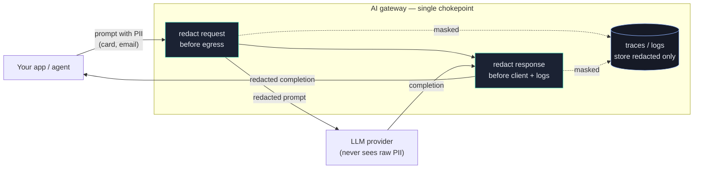

# 4.3 — PII redaction & data-loss prevention

!!! bottomline "Bottom line"
    The gateway sees every prompt and every completion in full — which makes it the one place you can stop sensitive data from leaving. In this session you configure **PII redaction** so card numbers, emails, and secrets are detected and masked **on the request before egress** to a third-party provider **and on the response before it reaches the client or your logs**. The rule that catches most people: redacting only the response still leaks the PII to the provider on the way *in*, so you redact on **both** paths — and you remember that masking a value in logs is not the same as removing it from the payload.

## Why this exists

Once your apps call models through the gateway, every prompt your users type — support tickets, code snippets, customer records — flows to a third-party provider you don't control and into whatever logging the call produces. A user pastes a full credit-card number into a "help me dispute this charge" prompt; without intervention, that number goes to OpenAI, into the provider's logs, and into yours.

PII redaction makes the gateway detect sensitive values (card numbers, emails, SSNs, API keys, phone numbers) and replace them with a placeholder before the payload moves on. Because the gateway is the **single chokepoint** every call passes through, you redact once, centrally, and cover every app and model — instead of trusting each service to scrub its own prompts and logs correctly (they won't).

The critical detail is *direction*. The provider sees the **request**, so PII has to be redacted on the way *in*, before egress — not just on the way out. And the gateway's own traces and logs capture both; redact before they're written, or your audit trail becomes the leak.

## The concept

Redaction is a guardrail-band policy that runs on **both** legs of the call — outbound to the provider and inbound to the client and logs:



This sits in the **Guardrails** layer alongside injection defense (4.2) and content safety (4.4). You configure it as request *and* response policies on the `AIGatewayRoute`: the gateway already holds the full prompt and completion at this chokepoint (for metering and guardrails), so it detects PII patterns and masks them inline before the data egresses to the provider or is written to a trace.

!!! pitfall "Watch out"
    **Redaction on the response only still leaks PII to the provider.** The provider receives the *request* — so if you redact just the completion on the way back, the raw card number already went upstream (and into the provider's logs) before any masking ran. Redact on the **request path (egress)** too. And remember: masking a value in *your* logs is not the same as removing it from the *payload* you sent — log scrubbing and request redaction are two separate switches, and you need both.

!!! apigee "From Apigee"
    You've done **data masking** in Apigee — configuring mask configurations so sensitive fields don't show up in the trace tool and debug sessions. PII redaction here is that idea raised a level. Apigee masking hides values in the *observability* surface; the underlying request still carried them to the backend. At the AI edge, redaction also rewrites the **payload that egresses** to the provider, so the third party never receives the raw value at all — not just "you can't see it in the trace," but "it never left your boundary unmasked."

    | Apigee | AI edge |
    | --- | --- |
    | Mask config (hide in trace/debug) | response/log redaction |
    | — (request still carried raw value) | request redaction before egress |
    | masking scope = observability | redaction scope = payload **and** observability |

!!! java "From Java microservices"
    It's the log-scrubbing and DLP you'd bolt onto one service — a Logback masking converter, a `MaskingPatternLayout`, a regex that turns card numbers into `****` before they hit the log file — applied to **every** prompt and completion at one chokepoint instead of per service. And it goes further than log scrubbing: your masking converter only cleans what *you* log, but the gateway also cleans what *leaves your boundary* to the provider. One policy at the edge replaces a scrubber you'd otherwise have to add, test, and maintain in every service that talks to a model.

!!! breaks "Where the analogy breaks"
    A Logback masking layout runs at the very end, on the log line you're about to write — it never touches the data your service already sent over the wire. Gateway redaction has to act *earlier*, on the request body itself, *before* it egresses, because the provider is the party you're protecting against. So the mental model isn't "scrub the logs"; it's "rewrite the payload in flight, on both directions, and the logs get the already-redacted version for free." Conflating the two leads to the classic miss: scrubbing logs while the provider quietly receives everything.

## Hands-on lab

<div class="lab" markdown="1">
#### Lab — redact a card number before it leaves, and in the logs

**Prereqs:** the gateway and `AIGatewayRoute` from 1.5 with caller auth (4.1) in place (export `$NAMESPACE`, `$GATEWAY_HOST`, and a valid `$GATEWAY_KEY`), and `kubectl`. (Redaction field names track your Envoy AI Gateway / Tetrate AI Guardrails release — verify against the PII/guardrails docs for your version.)

**1. Configure PII redaction on both the request and the response.** The request rule protects egress to the provider; the response rule protects the client and logs:

```yaml
apiVersion: aigateway.envoyproxy.io/v1alpha1
kind: AIGatewayRoute
metadata:
  name: ai-gateway-route          # the route from session 1.5
  namespace: ${NAMESPACE}
spec:
  # ...existing rules/backendRefs from earlier sessions...
  guardrails:
    request:                       # redact BEFORE egress to the provider
      - name: pii-redact-in
        type: PIIRedaction
        action: Redact             # mask, don't block
        entities: [CREDIT_CARD, EMAIL, PHONE_NUMBER, US_SSN]
    response:                      # redact BEFORE the client + logs see it
      - name: pii-redact-out
        type: PIIRedaction
        action: Redact
        entities: [CREDIT_CARD, EMAIL, PHONE_NUMBER, US_SSN]
```

**2. Apply it and confirm the route is accepted:**

```bash
kubectl apply -f ai-route-pii.yaml
kubectl get aigatewayroute ai-gateway-route -n "$NAMESPACE" \
  -o jsonpath='{.status.conditions[?(@.type=="Accepted")].status}{"\n"}'
```

**3. Send a prompt containing fake PII** (a test card number and email) and capture the completion:

```bash
curl -s "https://$GATEWAY_HOST/v1/chat/completions" \
  -H "authorization: Bearer $GATEWAY_KEY" \
  -H "content-type: application/json" \
  -d '{"model":"gpt-4o-mini","messages":[{"role":"user",
       "content":"Draft a reply about the charge on card 4111 1111 1111 1111, reply to jane.doe@example.com."}]}'
```

**4. Confirm the PII was redacted before egress AND in the gateway's logs.** The provider-bound request should show a placeholder, not the raw value:

```bash
# the gateway's access/guardrail logs must show the masked form, never the raw card/email
kubectl logs -n "$NAMESPACE" deploy/ai-gateway --tail=50 | grep -iE "redact|<CREDIT_CARD>|<EMAIL>"
# you should see the masked tokens (e.g. <CREDIT_CARD>, <EMAIL>) — and NOT 4111 1111 1111 1111
```

!!! pitfall "Watch out"
    If you configured only the `response` rule, this lab will *look* fine in the completion while the raw card number was already sent to the provider on the request — the leak you can't see. Verify the **request** side explicitly: grep the egress/guardrail log for the raw digits and confirm they're absent. A clean response is not evidence the request was clean.

**What success looks like:** the prompt's card number and email appear **only as placeholders** (e.g. `<CREDIT_CARD>`, `<EMAIL>`) in what egresses to the provider and in the gateway's logs/traces — the raw values never leave your boundary and never land in an audit record — while the model still returns a useful, coherent reply built around the masked tokens.
</div>

## Verify it

!!! failure "Common failure modes"
    - **Redacting the response only.** The raw PII already egressed to the provider on the request. Always configure the request (egress) rule too — this is the single most common and most damaging miss.
    - **Masking logs but not the payload.** A clean log line doesn't mean a clean request. Log scrubbing and request redaction are separate; verify the provider-bound body, not just the trace.
    - **Entity gaps.** Redaction covers the entity types you enable. If you mask cards and emails but not SSNs or API keys, the unlisted types flow through untouched. Enumerate every category you care about and revisit the list.
    - **Over-redaction breaking answers.** Mask too aggressively and the model loses context it needed (e.g. an order ID it should echo back). Tune entities and placeholders so the completion stays useful.
    - **Assuming redaction replaces auth or guardrails.** It hides sensitive *values*; it doesn't authenticate the caller (4.1) or stop an injection (4.2). It's one layer in the band, not a substitute for the others.

!!! stretch "Stretch goal"
    Add an entity type the defaults miss — an internal employee ID format or an API-key pattern specific to your org — as a custom redaction rule, then send a prompt containing it and confirm it's masked on egress and in the logs. Most real DLP gaps aren't the standard cards-and-emails the built-in detectors already catch; they're the org-specific identifiers no off-the-shelf classifier knows about.

## Recap & next

You can now redact PII at the gateway on **both** directions — masking sensitive values on the request before they egress to a provider and on the response before they reach the client or your logs — using the gateway as the single chokepoint that covers every app and model. You can also articulate the two traps: response-only redaction still leaks to the provider, and masking logs is not removing from the payload.

**Next — 4.4:** redaction hides sensitive data; the last guardrail judges the *content itself*. You'll add **content safety and output moderation** so the gateway can refuse or flag toxic, unsafe, or policy-violating completions before they reach a user.
