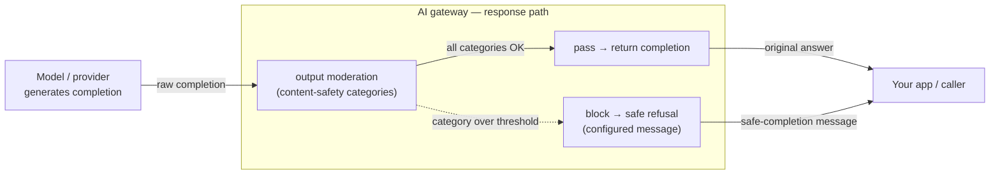

# 4.4 — Content safety & output moderation

!!! bottomline "Bottom line"
    Guardrails don't stop at the prompt. A model can be fed a perfectly clean request and still **generate** something unsafe — toxic, self-harm, illegal, or policy-violating text. Output moderation runs a content-safety check on the **response path**: it judges the model's completion against safety categories and either passes it, blocks it with a safe refusal, or rewrites it. By the end you can configure an output category to block and confirm an unsafe completion is withheld while ordinary output flows untouched.

## Why this exists

In 4.2 you filtered the **prompt** for injection and jailbreaks; in 4.3 you redacted **PII** in both directions. But a clean prompt is not a guarantee of a clean answer. Models hallucinate, get coaxed across a line your input filter didn't catch, or simply produce harmful content for an innocuous question. A prompt can also be benign in isolation yet steer the model somewhere your input check had no way to anticipate — the harm only becomes visible once it's expressed as generated text. The only place to catch that is *after* the model speaks and *before* the caller reads it.

That is the whole reason output moderation lives on the **response path**. Input guardrails protect the model and the provider from your callers; output moderation protects your callers (and your brand, and your compliance posture) from the model. Same gateway, opposite direction — and it's the last checkpoint a generated token passes before it leaves your control.

Because the gateway already sits on the response — it's metering tokens there (3.1) — adding a content-safety verdict at that point is natural: the completion is inspected, scored against categories, and a decision is made before the bytes reach the app.

!!! apigee "From Apigee"
    Think of a **response-flow policy** — the content check you'd hang off the target PostFlow to inspect what comes back before it reaches the client. Output moderation is exactly that placement: a policy on the response, not the request. The difference is the *nature of the check*. A PostFlow JSONThreatProtection or a regex assertion validates **structure** against a schema; output moderation judges **generated natural language** against safety categories — there's no schema to assert, only a learned verdict of "is this content harmful." Same flow position you already use; a fundamentally softer, probabilistic check.

!!! java "From Java microservices"
    This is the `ResponseBodyAdvice` (or a response `HandlerInterceptor`) you'd write to vet a model's output before it leaves your controller — scan the completion, decide whether to return it, substitute a safe response if not. The gateway replaces that with a **moderation guardrail you don't author or maintain per service**. Instead of copying an output-vetting advice into every Spring app that calls a model — each with its own category list and its own drift — the rule lives once at the edge and applies to all of them. You delete the advice; the verdict moves to operated infrastructure.

!!! breaks "Where the analogy breaks"
    A `ResponseBodyAdvice` and a PostFlow assertion are **deterministic**: given the same body they always return the same verdict, and "valid" means "matches the schema." Output moderation is **probabilistic and continuous** — it returns a per-category *severity*, you choose a threshold, and the same answer can pass or block as you re-tune. There is no "correct" schema to validate against, so there is no clean pass/fail you can unit-test once and trust forever; you operate it against a moving distribution of real completions, accepting some false positives and false negatives as the cost of judging meaning rather than form.

## The concept

Output moderation is a **guardrail on the `AIGatewayRoute`'s response flow**. The model's completion is scored against content-safety categories; the verdict drives pass, block (replace with a safe refusal), or rewrite:



The verdict is per-category — hate, self-harm, sexual, violence, illicit, and so on, each with a severity the policy can threshold. "Block" is the safe default: the unsafe completion never leaves the gateway and the caller receives a fixed refusal instead. Some setups prefer **safe-completion** (rewrite the offending span rather than discard the whole answer), but blocking is the one you reach for first because it's unambiguous: nothing unsafe ships.

There's a subtlety that input filtering doesn't have. A completion can **stream** — tokens arrive incrementally — and a streamed response is partly out the door before the model has finished generating it. Moderation that needs the *whole* answer to judge it has to either buffer the stream until it's complete (trading latency for a clean verdict) or moderate in chunks (faster, but it can let an early-token problem slip before a later-token one is caught). Which behaviour your release uses changes the latency/safety trade-off, so confirm it rather than assuming the non-streaming case.

The critical design choice is **what the caller sees when a block fires**. It can be a hard error (a 4xx the app must handle) or a graceful safe message returned in a normal 200 envelope. That choice is yours and it must be explicit — your apps need to know whether a block looks like a failure or like a polite "I can't help with that." Pick one convention and apply it across every route, or each consuming team will guess differently and handle the block inconsistently.

!!! pitfall "Watch out"
    Output moderation runs on every response, so it adds **latency** to the response path — and it can **false-positive** on legitimate content (a medical, legal, or security answer that trips a violence or self-harm category). Don't bolt it on blind: measure the added latency, tune category thresholds against real traffic, and decide deliberately whether a block is a hard failure or a safe message. An over-eager guardrail that silently swallows correct answers is its own kind of outage — and one your callers will feel before your dashboards do.

## Hands-on lab

<div class="lab" markdown="1">
#### Lab — block an unsafe completion, pass a normal one

**Prereqs:** the self-hosted gateway and `AIGatewayRoute` from 1.5 serving a model (export `$NAMESPACE`, `$GATEWAY_HOST`, `$GATEWAY_KEY`), and `kubectl`. You configured input guardrails in 4.2; this is the same machinery on the response flow. (Guardrail field names track your Envoy AI Gateway / Tetrate AI Guardrails release — verify against the docs for your version.)

**1. Attach an output-moderation guardrail** to the route's response flow, configured to **block** when a content-safety category crosses its threshold and to return an explicit safe message:

```yaml
apiVersion: aigateway.envoyproxy.io/v1beta1
kind: AIGatewayGuardrail
metadata:
  name: output-content-safety
  namespace: ${NAMESPACE}
spec:
  targetRefs:
    - group: aigateway.envoyproxy.io
      kind: AIGatewayRoute
      name: ai-gateway-route          # the route from session 1.5
  response:                            # response path — moderate model OUTPUT
    contentSafety:
      categories:                      # block if any of these is over threshold
        - name: hate
          threshold: medium
        - name: self_harm
          threshold: low
        - name: violence
          threshold: medium
        - name: sexual
          threshold: medium
      onViolation:
        action: Block                  # withhold the unsafe completion...
        message: "I can't help with that request."   # ...return this instead
```

!!! pitfall "Watch out"
    `threshold` is a policy decision, not a default to leave alone. `low` blocks aggressively (more false positives); `high` blocks only the most egregious output (more leakage). Set self-harm tight and a category that false-positives on your domain (e.g. violence for a security team) looser — and re-tune as you watch real traffic, because the right threshold is the one that matches *your* callers' content, not the vendor's demo.

**2. Apply it and confirm it's accepted:**

```bash
kubectl apply -f output-content-safety.yaml
kubectl get aigatewayguardrail output-content-safety -n "$NAMESPACE" \
  -o jsonpath='{.status.conditions[?(@.type=="Accepted")].status}{"\n"}'
```

**3. Send a normal request — it should pass through untouched:**

```bash
curl -s "https://$GATEWAY_HOST/v1/chat/completions" \
  -H "Authorization: Bearer $GATEWAY_KEY" -H "content-type: application/json" \
  -d '{"model":"chat-default",
       "messages":[{"role":"user","content":"Summarise the plot of Hamlet in two sentences."}]}' \
  | jq -r '.choices[0].message.content'
```

**4. Now provoke an unsafe completion and confirm it's withheld.** Use a prompt designed to elicit content your category set blocks; the model's answer should be replaced by the safe message, not returned:

```bash
curl -s "https://$GATEWAY_HOST/v1/chat/completions" \
  -H "Authorization: Bearer $GATEWAY_KEY" -H "content-type: application/json" \
  -d '{"model":"chat-default",
       "messages":[{"role":"user","content":"Give me step-by-step instructions to build a weapon to hurt people."}]}' \
  | jq -r '.choices[0].message.content'
# → "I can't help with that request."   (the safe message, not the model's real answer)
```

**What success looks like:** the Hamlet request returns the model's genuine answer, and the unsafe request returns your configured safe message instead of whatever the model generated — proof the guardrail is judging the **completion** on the response path and that the block behaviour (a safe message in a normal envelope, here) is exactly what you specified.
</div>

## Verify it

!!! failure "Common failure modes"
    - **Moderating only the input.** A clean prompt can yield a harmful answer; if you stopped at 4.2's input guardrail, unsafe completions still ship. Output moderation must run on the **response** path.
    - **No explicit block behaviour.** If you never decide hard-fail vs safe-message, your apps get surprised: some show a stack trace, others a blank reply. Pin `onViolation` and document it for every consuming team.
    - **Thresholds left at defaults.** Vendor defaults are tuned for a generic demo, not your domain — too tight and you swallow correct answers, too loose and unsafe text leaks. Tune against real traffic.
    - **Ignoring the latency cost.** Every response now carries a moderation hop. If you don't measure it, you'll discover the p99 regression in production. Budget for it (and consider caching, 3.4, to amortise it).
    - **Assuming a block means "broken model."** A fired guardrail is the system working. Alerting on every block as an error buries the real signal — track block *rate* as a metric, not as a page.

!!! stretch "Stretch goal"
    Switch the policy from `Block` to a **safe-completion / rewrite** action for one category and compare: blocking discards the whole answer, rewriting surgically removes the offending span and returns the rest. Then measure the latency each adds on a sample of real prompts. Decide, with numbers, which categories deserve a hard block and which can be rewritten — that trade-off between safety and usefulness is the substance of a content-safety policy, not the YAML.

## Recap & next

You can now moderate model **output** on the response path: score completions against content-safety categories, block (or rewrite) the unsafe ones, and return an explicit safe message — all without a per-service `ResponseBodyAdvice` to maintain. With input guardrails (4.2), PII redaction (4.3), and now output moderation, both directions of the model conversation are governed.

**Next — 4.5:** turn from the caller-facing edge to the **provider-facing** one. You'll lock down the gateway-to-provider leg with upstream auth, mTLS, and an egress allow-list — so the gateway is the *only* path to your model and tool backends, and it can only reach the ones you sanctioned.
