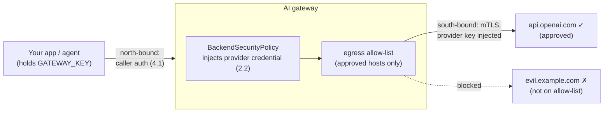

# 4.5 — Securing the upstream: provider auth, mTLS & egress

!!! bottomline "Bottom line"
    Everything so far secured the **north-bound** leg — the caller reaching the gateway. This session secures the **south-bound** leg — the gateway reaching the provider or tool server. Three controls: upstream **auth** (the gateway injects provider credentials, recap from 2.2), **TLS/mTLS** to the upstream so the connection is encrypted and the upstream is who it claims to be, and an **egress allow-list** so the gateway can *only* reach the provider hosts you sanctioned. By the end you can restrict egress to approved hosts and prove a request to a rogue host is blocked.

## Why this exists

You spent Part 4 hardening the front door: authenticating callers (4.1), filtering prompts (4.2), redacting PII (4.3), moderating output (4.4). All of that governs traffic *into* the gateway. None of it governs traffic *out* of it.

The gateway-to-provider leg is where the real secrets live and where data actually leaves your perimeter. If that leg is unencrypted, prompts (and the PII you didn't catch) cross the wire in clear. If the gateway trusts any upstream, a DNS hijack or a typo'd hostname silently exfiltrates traffic to an impostor. And if the gateway can dial *any* host on the internet, an attacker who lands a foothold can use your sanctioned, credentialed gateway as an exfiltration proxy to a destination you never approved. Securing the upstream closes all three.

The keystone is **where the provider credentials live**. The entire model of this course is that apps hold a *gateway* key, never a provider key (1.1) — the gateway is the single place that holds the real OpenAI/Anthropic/Bedrock credential and injects it on the way out (2.2). That centralisation is only worth anything if the gateway is genuinely the **only** path with those credentials, on an outbound leg you control end to end.

!!! apigee "From Apigee"
    This is the **south-bound trust story you already configure on TargetServers and target endpoints** — just pointed at LLM providers and tool servers instead of REST backends. The pieces map cleanly:

    | Apigee south-bound | AI gateway equivalent |
    | --- | --- |
    | TargetServer / target endpoint TLS, truststore | `BackendTLSPolicy` — CA pinning to the upstream |
    | Two-way TLS (client keystore on the target) | mTLS — client cert presented to the provider |
    | Credential injection (e.g. service-account or key on the target) | `BackendSecurityPolicy` injects the provider key (2.2) |
    | Locking targets to known hosts / no open egress | egress allow-list, deny-by-default |

    If you've configured a target SSLInfo with a truststore and restricted a proxy to its TargetServers, you've already built this — for REST targets. The novelty is only the upstream's identity (a model provider) and the credential's nature (a provider API key).

!!! java "From Java microservices"
    Each Spring service that calls an external API configures this per service: a `RestClient`/`WebClient` with a **truststore** (and a keystore for mTLS) so it trusts the right upstream, a credential pulled from config, and — if your platform is mature — an **egress allow-list** at the sidecar or `NetworkPolicy` so the pod can only reach sanctioned hosts. The gateway **centralises all three**. Instead of every service shipping its own truststore, its own provider key, and its own egress rules (and drifting), the gateway holds the credential, pins the upstream, and enforces egress once. You delete the per-service south-bound config the same way you deleted the per-service provider key in 1.1.

!!! breaks "Where the analogy breaks"
    For a REST backend, "egress" is a network nicety — the service still works if you skip it. Here, the allow-list is a **data-exfiltration control wired to where your most sensitive payloads and your only provider credentials sit**. The blast radius is different: a foothold in a REST service leaks that service's data; a foothold in (or around) the AI gateway, if egress is open, turns a *sanctioned, credentialed* path into an exfiltration proxy for prompts, PII, and tool results across your whole estate. Treat south-bound egress here as a security boundary, not the optional hardening it often is for plain microservices.

## The concept

North-bound auth proves *who is calling the gateway*; south-bound controls prove *that the gateway reaches only sanctioned providers, encrypted, with the right credential injected*. The egress allow-list is the new lock:



Three layers stack on the south-bound leg. **Upstream auth** — `BackendSecurityPolicy` (2.2) attaches the provider API key or cloud credential to the outbound request, so the app never holds it. **Transport security** — a `BackendTLSPolicy` pins the upstream's CA and, for mTLS, presents a client certificate, so the connection is encrypted and the upstream is authenticated, not just trusted by hostname. **Egress restriction** — the gateway's allowed destinations are an explicit allow-list of provider/tool hosts; anything not on it is refused at the gateway, so even a compromised route or a mistyped backend can't reach an unsanctioned endpoint.

!!! pitfall "Watch out"
    The egress allow-list is **defeated the instant a provider key lives in one of your apps.** If any service still holds a real OpenAI key, that service can call `api.openai.com` directly — bypassing the gateway, its budgets (3.2), its guardrails (4.2–4.4), and this very allow-list. A leaked app key is then a direct line to the provider that no gateway policy can see or stop. Egress control is only as strong as your guarantee that the **gateway is the sole holder of provider credentials**. Audit for stray keys (the 1.1 inventory) *before* you trust the allow-list, or you've locked the front door and left the credential under the mat.

## Hands-on lab

<div class="lab" markdown="1">
#### Lab — restrict egress to approved provider hosts

**Prereqs:** the self-hosted gateway from 1.5 with an `AIServiceBackend` and a `BackendSecurityPolicy` injecting your provider key (from 2.2), plus `$NAMESPACE`, `$GATEWAY_HOST`, `$GATEWAY_KEY`, and `kubectl`. (Egress / TLS field names track your Envoy Gateway release — verify against the docs for your version.)

**1. Define the approved-hosts allow-list.** Restrict what the gateway is permitted to dial to your sanctioned provider host(s) only — here, OpenAI:

```yaml
apiVersion: gateway.envoyproxy.io/v1alpha1
kind: BackendTrafficPolicy
metadata:
  name: provider-egress-allowlist
  namespace: ${NAMESPACE}
spec:
  targetRefs:
    - group: gateway.networking.k8s.io
      kind: Gateway
      name: ai-gateway                # the Gateway from session 1.5
  egress:
    allowedHosts:                     # the ONLY destinations the gateway may reach
      - api.openai.com
      - api.anthropic.com
    defaultAction: Deny               # everything not listed is refused
```

**2. Pin transport security to the approved upstream** so the connection is encrypted and the upstream CA is verified (add a client cert here for full mTLS):

```yaml
apiVersion: gateway.envoyproxy.io/v1alpha1
kind: BackendTLSPolicy
metadata:
  name: openai-tls
  namespace: ${NAMESPACE}
spec:
  targetRefs:
    - group: gateway.networking.k8s.io
      kind: Backend
      name: openai                    # the AIServiceBackend's upstream
  validation:
    hostname: api.openai.com
    caCertificateRefs:
      - kind: ConfigMap
        name: provider-ca-bundle      # the CA you trust for the provider
```

!!! pitfall "Watch out"
    `defaultAction: Deny` is the whole point — an allow-list with a default of *allow* governs nothing. And be careful with wildcards: an over-broad entry like `*.example.com` re-opens the exfiltration path you just closed. List exact provider hostnames, deny by default, and add a host only when there's an approved provider behind it.

**3. Apply both policies and confirm they're accepted:**

```bash
kubectl apply -f provider-egress-allowlist.yaml -f openai-tls.yaml
kubectl get backendtrafficpolicy provider-egress-allowlist -n "$NAMESPACE" \
  -o jsonpath='{.status.conditions[?(@.type=="Accepted")].status}{"\n"}'
```

**4. Prove an approved call still works:**

```bash
curl -s -o /dev/null -w "approved provider -> HTTP %{http_code}\n" \
  "https://$GATEWAY_HOST/v1/chat/completions" \
  -H "Authorization: Bearer $GATEWAY_KEY" -H "content-type: application/json" \
  -d '{"model":"chat-default","messages":[{"role":"user","content":"ping"}]}'
# → approved provider -> HTTP 200
```

**5. Prove a rogue upstream is blocked.** Point a test backend/route at an unapproved host and call through it; the gateway must refuse to dial it:

```bash
# a route whose AIServiceBackend resolves to evil.example.com (not on the allow-list)
curl -s -o /dev/null -w "rogue host -> HTTP %{http_code}\n" \
  "https://$GATEWAY_HOST/v1/chat/completions" \
  -H "Authorization: Bearer $GATEWAY_KEY" -H "content-type: application/json" \
  -d '{"model":"rogue-route","messages":[{"role":"user","content":"ping"}]}'
# → rogue host -> HTTP 502/503  (gateway refused the unapproved egress)
```

**What success looks like:** the approved provider call returns `200`, the rogue-host call fails at the gateway because the destination isn't on the allow-list, and at no point did a provider credential leave the gateway. The gateway is now the *only* credentialed path out, encrypted to a verified upstream, and unable to reach anything you didn't sanction.
</div>

## Verify it

!!! failure "Common failure modes"
    - **Provider keys still in apps.** The single biggest hole: a leaked app key calls the provider directly and bypasses egress control, budgets, and every guardrail. The gateway must be the *only* holder of provider credentials.
    - **Allow-list defaults to allow.** Without `defaultAction: Deny`, the list is decorative — anything unlisted still gets out. Deny by default, permit the exact hosts.
    - **No upstream TLS verification.** Encrypting without verifying the upstream CA/hostname leaves you open to a hijacked or impersonated provider endpoint. Pin the CA (and use mTLS where the provider supports it).
    - **Wildcard egress entries.** `*.somecloud.com` re-opens the exfiltration path. Prefer exact hostnames; treat every wildcard as a decision to defend.
    - **Forgetting tool servers.** Agentic tool backends (Part 5) are upstreams too. An allow-list covering only model providers leaves MCP/tool egress wide open.

!!! stretch "Stretch goal"
    Stand up a deliberate exfiltration test: a route whose backend points at a host you control but did *not* add to the allow-list, and confirm the gateway refuses to reach it. Then flip `defaultAction` to `Allow` and watch the same request succeed — the gap between those two outcomes is precisely the value of deny-by-default egress. Finish by grepping your estate (the 1.1 inventory) one more time for any service still holding a real provider key; until that returns nothing, your allow-list has a bypass.

## Recap & next

You can now secure the south-bound leg: inject provider credentials at the gateway (2.2), encrypt and verify the upstream with `BackendTLSPolicy` / mTLS, and restrict egress to an explicit allow-list of sanctioned provider and tool hosts with deny-by-default. Combined with Part 4's north-bound controls, both directions are governed and the gateway is the single credentialed path to your providers. That completes Part 4.

**Next — 5.1:** the workload changes shape. A chat completion is one request; an **agent** is a loop of them — the model calls a tool, reads the result, calls another, and only then answers. You'll see what that does to budgets, guardrails, and identity when a single user prompt fans out into many governed round-trips.
