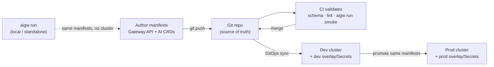

# 6.3 — Deploying & operating: Kubernetes, Gateway API & the aigw CLI

!!! bottomline "Bottom line"
    The gateway is not a console you click — it's **config-as-code**: Gateway API resources and the AI CRDs live in git, the `aigw` CLI runs them locally for fast iteration, and the **same manifests** promote unchanged from dev to prod through a GitOps pipeline. By the end of this session you can run the gateway standalone against your manifests with `aigw run`, then apply those identical manifests to a cluster with no edits — the operational model for everything you built in Parts 1–6.

!!! eli5 "In plain words"
    Instead of telling the door helper the rules out loud and hoping it remembers, you write them all down in one rulebook. Then you don't make up new rules for the practice room and different ones for the real room — you copy the exact same rulebook to both, changing nothing. So the helper behaves the same whether it's pretend or for real. Writing the rules down once and copying that same book everywhere is **config-as-code, promoted unchanged**.

## Why this exists

Across this course you've authored `AIGatewayRoute`s, `BackendTrafficPolicy`s, guardrails, `MCPRoute`s, and telemetry — all as YAML. That's not incidental: it's the whole operating model. There is no "save in the UI" step that lives only in one environment. The artifacts *are* Kubernetes resources, so they get versioned, reviewed, validated in CI, and rolled out the same way the rest of your platform is.

Two things make this practical. First, the **Gateway API** is the standard, portable contract — the same `Gateway`/`HTTPRoute` shapes work across conformant implementations, and the AI CRDs extend them. Second, the **`aigw` CLI** lets you run the gateway *locally or standalone* against the very manifests you'll ship, so you get a tight inner loop without a cluster — then promote the proven config outward.

!!! apigee "From Apigee"
    You've done **config-as-code and environment promotion** before — `apigeectl`/Maven deploy, proxy bundles in git, the same bundle pushed from `test` to `prod` with environment-scoped config keyed out. This is that discipline, with the artifacts changed: instead of a proxy bundle you promote **Kubernetes CRDs** (`Gateway`, `HTTPRoute`, `AIGatewayRoute`, policies) through a GitOps pipeline. The environment-specific bits you kept in Apigee KVMs and target servers become per-cluster Secrets and overlays. If you ever swore "never click-ops a proxy into prod," you already hold the principle this session operationalises.

!!! java "From Java microservices"
    This is your app's **CI/CD pipeline and Spring profiles**, applied to gateway config. Manifests in git, validated by CI, applied to dev then promoted to prod is exactly your build → test → deploy flow; per-cluster Secrets and overlays are your `application-dev.yml` vs `application-prod.yml` profiles, with the environment-specific values externalised out of the artifact. And `aigw run` is your local boot — `mvn spring-boot:run` before you ship — letting you exercise the real config on your laptop before it ever reaches a cluster.

!!! breaks "Where the analogy breaks"
    A Spring jar is a self-contained artifact you run anywhere; gateway CRDs are **declarative state reconciled by a controller**, not a process you start. "Deploy" means *apply the desired state and let the controller converge* — there's no main method, and a manifest can be accepted yet not yet programmed (you watch `status.conditions`, not a startup log). And unlike a profile that only flips values, a manifest can encode **cluster-specific assumptions** (a model that exists in one region, a Secret name) that silently break promotion. The artifact travels; the environment's truth must be externalised, or "same manifest everywhere" becomes a lie.

## The concept

The operating loop is GitOps: config is authored once, validated, and flows outward to clusters, with each environment pulling the same source of truth and layering only its own values on top:



The promise is that the box you ran with `aigw run` on your laptop, the resources CI smoke-tested, and the workload reconciled into prod are **the same manifests** — only the per-cluster overlay differs. Nothing is hand-edited on the way to production; promotion is "point the next environment at the merged config," not "re-apply changes by hand."

!!! pitfall "Watch out"
    Cluster-specific values baked into manifests break promotion. A hostname, a Secret's literal value, or a model name that only exists in one region, hard-coded into a CRD, means the "same" manifest fails in the next cluster — and you start hand-patching, which destroys the whole guarantee. Externalise those: per-cluster overlays (Kustomize) and Secrets, so the CRDs themselves travel unchanged and only the environment layer differs.

## Hands-on lab

<div class="lab" markdown="1">
#### Lab — run locally with `aigw`, then promote the same manifests

**Prereqs:** the `aigw` CLI installed, `kubectl` with access to a cluster running Envoy AI Gateway (the install from 1.5), and your manifests from earlier sessions in a git working tree. Export `$NAMESPACE`, `$GATEWAY_HOST`, and `$GATEWAY_KEY`.

**1. Keep environment-specific truth out of the CRDs.** The route and policy YAML are portable; the per-cluster values live in a Secret and a thin overlay, never inline:

```yaml
# base/ai-gateway-route.yaml — portable, identical across clusters
apiVersion: aigateway.envoyproxy.io/v1alpha1
kind: AIGatewayRoute
metadata:
  name: ai-gateway-route
  namespace: ${NAMESPACE}
spec:
  schema:
    name: OpenAI
  rules:
    - backendRefs:
        - name: openai-backend        # provider creds resolved from a Secret, not here
```

```yaml
# overlays/prod/provider-secret.yaml — per-cluster, NOT promoted as-is
apiVersion: v1
kind: Secret
metadata:
  name: openai-credentials
  namespace: ${NAMESPACE}
type: Opaque
stringData:
  apiKey: ${GATEWAY_KEY}              # injected per cluster by your secret manager
```

!!! pitfall "Watch out"
    Never commit a real provider key or a cluster's hostname into the base manifests. The moment a Secret value or an environment hostname lives in the shared YAML, the manifest stops being portable and you've recreated click-ops by another name. Keep secrets in your secret manager and reference them by name.

**2. Run the gateway locally against those manifests** — no cluster needed — to smoke-test routing and policy on your laptop:

```bash
# standalone run of the SAME base manifests you'll ship
aigw run base/ai-gateway-route.yaml base/token-budget.yaml

# in another shell, exercise the local gateway
curl -s "http://localhost:1975/v1/chat/completions" \
  -H "authorization: Bearer $GATEWAY_KEY" -H "content-type: application/json" \
  -d '{"model":"gpt-4o-mini","messages":[{"role":"user","content":"ping"}]}' | jq '.choices[0].message.content'
```

**3. Apply the identical base manifests to a cluster** — same files, only the overlay differs — and confirm the controller programmed them:

```bash
# same base/, plus the per-cluster overlay (Kustomize) — no edits to base
kubectl apply -k overlays/prod
kubectl get aigatewayroute ai-gateway-route -n "$NAMESPACE" \
  -o jsonpath='{.status.conditions[?(@.type=="Accepted")].status}{"\n"}'
```

**What success looks like:** `aigw run` serves your routes and policies locally with no cluster, and the **exact same base manifests** — applied with only a per-cluster overlay and Secret — come up `Accepted` in the cluster. You promoted config from laptop to prod with **no change to the CRDs themselves**, which is the entire operating model in one motion.
</div>

## Verify it

!!! failure "Common failure modes"
    - **Hard-coded environment values in base manifests.** A literal hostname, Secret value, or region-only model name in a shared CRD breaks the next cluster — externalise to overlays and Secrets.
    - **Hand-editing manifests during promotion.** Any manual patch on the way to prod means "same config" is a fiction and the next sync will fight you; let GitOps reconcile from the merged source.
    - **Skipping `aigw run` before applying.** Validating only in-cluster makes the inner loop slow and pushes config errors all the way to a cluster; smoke-test locally first.
    - **Accepted ≠ programmed.** A manifest can be `Accepted` while not yet reconciled into the data plane; check `status.conditions`, not just `kubectl apply` exit code.
    - **No CI validation gate.** Manifests merged without schema/lint/`aigw run` checks let a broken CRD reach a cluster; gate the pipeline before sync.

!!! stretch "Stretch goal"
    Take one session's manifests and split them properly into a Kustomize `base/` plus `overlays/dev` and `overlays/prod`, with every environment-specific value (hostnames, Secrets, model availability) pushed into the overlays. Then prove portability: `kubectl apply -k overlays/dev` and `-k overlays/prod` from the *same base*, and diff the rendered output — the only differences should be the externalised values, nothing in the CRDs themselves.

## Recap & next

You can now operate the gateway as **config-as-code**: Gateway API and AI CRDs versioned in git, validated in CI, run locally with `aigw run`, and promoted **unchanged** across clusters via GitOps — with cluster-specific truth externalised into overlays and Secrets so the same manifests genuinely travel. This is the deployment discipline that makes everything in Parts 1–6 reproducible and reviewable.

**Next — 6.4:** with the gateway deployed and operated, you'll make it **production-ready** — defining SLOs for AI traffic, designing safe rollouts of model and policy changes, and standing up the cost dashboards that keep spend and reliability honest.
