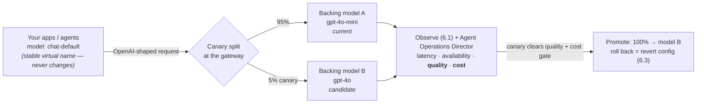

# 6.4 — Production readiness: SLOs, rollout & cost dashboards

!!! bottomline "Bottom line"
    Before an AI gateway carries real traffic it needs the same go-live discipline you'd give any other front door — plus three AI-specific items: **token-budget** enforcement, **guardrail** coverage, and a **safe model-rollout** plan. By the end of this session you can write SLOs for the gateway (latency + availability), read the cost/usage dashboards in **Tetrate Agent Operations Director**, and swap a backing provider model behind a stable **virtual model name** using a **canary** fraction — watching quality and cost, not just whether the lights are green.

## Why this exists

Everything in Part 6 so far made the gateway *observable* (6.1), *debuggable* (6.2), and *operated as config-as-code* (6.3). Production readiness is the step that turns "it runs" into "we'll page someone when it doesn't, and we know what 'doesn't' means." That part isn't new — it's the readiness review you've run a dozen times. What *is* new is that an AI edge has failure modes a payments service never had.

The sharpest one is **model rollout**. On a REST backend, swapping the implementation behind a stable contract is routine: same request shape in, same response shape out, you canary on error rate and move on. Swap the backing model behind your gateway's `chat-default` and the wire contract is identical — same OpenAI-shaped JSON — but the *content* can shift underneath you. A newer model may format JSON differently, refuse prompts the old one allowed, get slower per token, or cost 3× more for the same answer. Latency and availability can stay perfectly green while the thing your users actually receive quietly degrades. So the readiness review here has to cover dimensions your old SRE checklist never measured: output quality and per-call cost.

!!! apigee "From Apigee"
    This is your **Apigee production-readiness checklist**, extended for AI. Everything you'd sign off before promoting a proxy to prod transfers: SLOs and error budgets, an on-call rotation, environment promotion (6.3), and a tested rollback. Apigee Analytics becomes **Agent Operations Director** for the cost view. The new line items are AI-specific:

    | Apigee readiness item | AI-gateway equivalent |
    | --- | --- |
    | Quota tuned & enforced | **Token budgets** fire over limit (3.1) |
    | Threat/JSON policies on | **Guardrails + PII** cover every path (4.2–4.4) |
    | Target health & failover | **Provider fallback** proven (2.x) |
    | Revision rollout / rollback | **Virtual-model swap + canary** (3.x) |
    | Analytics dashboards live | **Agent Operations Director** cost/usage |

!!! java "From Java microservices"
    This is the **pre-launch readiness review you'd run before flipping a feature flag on a payments service** — applied to the AI edge. You already know the moves: define SLOs and an error budget, roll out behind a flag to a small cohort first, watch the dashboards, keep the kill-switch one click away. A model swap behind a virtual name *is* a feature flag: the candidate model is the new code path, the canary fraction is your percentage rollout, and "revert config" is toggling the flag back off — no client redeploy.

!!! breaks "Where the analogy breaks"
    On a payments service, the contract is the schema: if the response still validates, the rollout is safe and a green error rate genuinely means "ship it." A model swap holds the *schema* identical while changing the *substance* — tone, format discipline, refusal behaviour, tokens burned per answer. So the usual signals lie. A 100% success rate and flat latency can sit on top of a model that now returns prose where the old one returned strict JSON, or costs triple for the same task. There is no `@Valid` and no HTTP status that catches a quality or cost regression — you have to measure those directly, which no readiness review you've run before required.

## The concept

A safe model rollout fronts a **stable virtual model name** (the client-facing string your apps send, defined back in 3.x) and changes only what's *behind* it — first for a canary fraction of traffic, then for everyone once the canary clears a quality-and-cost gate:



The unit you protect is the **virtual model name**, never the provider model string. Apps keep sending `chat-default`; operations decides what answers it. That decoupling — taught in 3.3 as the approved-model catalog — is exactly what makes a canary possible: you can route a slice of `chat-default` traffic to a candidate model without touching a single client.

SLOs for the gateway split cleanly into things the gateway *owns* and things it *passes through*. The gateway owns its own **availability** (did it accept and route the request?) and its **added latency** (time spent in auth, guardrails, routing — not the model's generation time, which you can't control). Measure those separately, because a slow *provider* is not a gateway SLO breach, and conflating them sends you debugging the wrong layer at 3am.

!!! pitfall "Watch out"
    Swapping a model can silently change output **quality, format, and cost** even when latency and availability look perfect. A model that returns prose where the old one returned strict JSON will pass every availability probe and break every downstream parser. **Canary on quality and cost, not just on whether the call succeeded.** A green `200` rate is necessary but nowhere near sufficient for a model rollout.

!!! pitfall "Watch out"
    Don't write an SLO against the *provider's* end-to-end latency — you don't control how long a model takes to generate. Scope your latency SLO to **gateway-added overhead** (auth + guardrails + routing), and track provider generation time as a separate observed metric so a provider slowdown doesn't burn your error budget for code you can't fix.

## Hands-on lab

<div class="lab" markdown="1">
#### Lab — write SLOs and execute a canary model swap

**Prereqs:** the operated gateway from 6.3 (export `$NAMESPACE` and `$GATEWAY_HOST`), `kubectl`, the observability stack from 6.1 wired to Agent Operations Director, and a route exposing a **virtual model name** `chat-default` (from 3.3) currently backed by `gpt-4o-mini`.

**1. Write down the SLOs** as plain config you can review and version — keep it next to the manifests from 6.3:

```yaml
# slo.gateway.yaml — the contract you'll be paged against
gateway_slos:
  availability:
    objective: 99.9%          # gateway accepted + routed the request
    window: 28d
    excludes: [provider_5xx]  # a provider outage is not a gateway breach
  added_latency:
    objective_p95_ms: 50      # auth + guardrails + routing ONLY
    note: provider generation time tracked separately, not in this SLO
  budget_enforcement:
    objective: "100% of over-budget calls rejected"   # 3.1 token limits MUST fire
  guardrail_coverage:
    objective: "100% of chat AND tool paths inspected" # 4.2-4.4, incl. MCP (5.x)
```

**2. Stand up the canary** by giving `chat-default` two backends and weighting them — 95% to the current model, 5% to the candidate. Apps keep sending `chat-default`; only this config changes:

```yaml
apiVersion: aigateway.envoyproxy.io/v1alpha1
kind: AIGatewayRoute
metadata:
  name: chat-default
  namespace: ${NAMESPACE}
spec:
  rules:
    - matches:
        - headers:
            - name: x-ai-eg-model        # the virtual name clients send (3.3)
              value: chat-default
      backendRefs:
        - name: openai-gpt-4o-mini        # current — 95%
          weight: 95
        - name: openai-gpt-4o             # candidate — 5% canary
          weight: 5
```

**3. Apply it and confirm both backends are programmed:**

```bash
kubectl apply -f chat-default-canary.yaml
kubectl get aigatewayroute chat-default -n "$NAMESPACE" \
  -o jsonpath='{.status.conditions[?(@.type=="Accepted")].status}{"\n"}'
```

**4. Drive traffic and watch the canary on quality + cost, not just status.** Fire a batch as a real caller and compare the candidate's behaviour against the baseline:

```bash
for i in $(seq 1 50); do
  curl -s "https://$GATEWAY_HOST/v1/chat/completions" \
    -H "Authorization: Bearer $GATEWAY_KEY" -H "content-type: application/json" \
    -d '{"model":"chat-default","max_tokens":256,
         "messages":[{"role":"user","content":"Return strict JSON: {\"ok\":true}"}]}' \
    | jq -c '{model:.model, tokens:.usage.total_tokens, body:.choices[0].message.content}'
done
```

In **Agent Operations Director**, slice the dashboard by backing model and compare candidate vs baseline on: tokens-per-call (cost), p95 generation latency, error rate, and — read it yourself — whether the candidate still returns parseable JSON. That last check is the one no probe does for you.

**5. Promote or roll back.** If the candidate clears the gate, raise its weight to 100. If quality or cost regressed, set it back to 0 — a pure config revert (6.3), no client redeploy:

```bash
# roll back instantly: candidate weight -> 0, current -> 100, re-apply
kubectl apply -f chat-default-canary.yaml   # edited weights, GitOps-tracked
```

!!! pitfall "Watch out"
    A canary that's too small or too short proves nothing. 5% of low-traffic minutes may be a handful of calls — not enough to surface a quality regression that only shows on certain prompt shapes. Size the canary by **call volume and prompt diversity**, and hold it long enough to see real user inputs, not just your smoke test.

**What success looks like:** an SLO file you'd be comfortable being paged against, a `chat-default` route serving 5% of traffic from a candidate model with no client change, an Agent Operations Director view comparing candidate and baseline on **cost and quality** (not just availability), and a one-command rollback that reverts config rather than redeploying any app.
</div>

## Verify it

!!! failure "Common failure modes"
    - **Green SLOs, broken output.** Availability and latency are nominal but the new model changed its output format or refused prompts the old one served. You measured the wrong dimensions — quality and cost must be in the rollout gate.
    - **Latency SLO blames the gateway for the provider.** Scoping the latency objective to end-to-end time means every provider slowdown burns your error budget for overhead you don't own. Separate gateway-added latency from provider generation time.
    - **Clients pinned to the provider model string.** If an app hard-codes `gpt-4o-mini` instead of the virtual `chat-default`, you can't canary or roll back without redeploying it — the whole decoupling from 3.3 is defeated.
    - **No tested rollback.** A rollout plan without a rehearsed revert isn't a plan. Confirm the weight-to-zero rollback actually restores the old behaviour *before* you need it at 3am.
    - **Budgets and guardrails left out of readiness.** Latency and availability are table stakes; if token limits (3.1) don't fire over budget or a guardrail (4.2–4.4) misses a path, you're "ready" on the wrong axis.

!!! stretch "Stretch goal"
    Add an **error-budget burn alert** to your gateway availability SLO and wire it to on-call: when the 28-day budget burns faster than a threshold, page. Then deliberately point the canary at a model you know formats output differently and confirm your quality gate catches it *before* you'd have promoted — proving the review measures the dimensions that actually break users, not just the ones that are easy to graph.

## Recap & next

You can now run a go-live review for an AI gateway: write **SLOs** that separate gateway-owned availability and added latency from provider behaviour, read **cost and usage** in Agent Operations Director, and execute a **safe model swap** behind a stable virtual model name with a canary fraction — gating promotion on quality and cost, with a one-command config rollback. Production readiness is now an operated discipline, not a hope.

**Next — 7.1:** the capstone. You'll assemble every layer of the course — caller auth, model tiers, token budgets and cost attribution, guardrails and PII, routing and fallback, egress control, MCP tools, all observed and operated as config-as-code — into one governed multi-provider agent platform, and run an end-to-end readiness review against the assembled whole.
